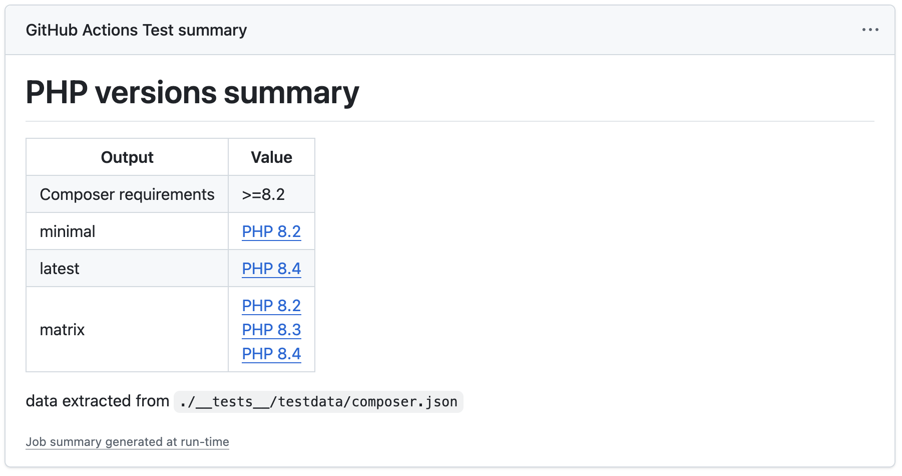

# PHP Version Action

[](https://github.com/antfroger/php-version-action)

[](https://github.com/antfroger/php-version-action/workflows/check-dist.yml)
[](./badges/coverage.svg)
[](https://github.com/antfroger/php-version-action/releases)

A GitHub Action that automatically determines PHP versions for your workflows by reading your `composer.json` file. This
action eliminates the need to hardcode PHP versions in your GitHub Actions workflows, making them more maintainable and
automatically up-to-date.

## Overview

From your `composer.json` and the released versions of PHP (read from [PHP.Watch](https://php.watch)), this action
determines a matrix of all the versions to be used as a build matrix in your GitHub Actions.

It also exposes the minimal and latest versions as variables to your workflow.

- **Automatic PHP Version Detection**: Reads PHP version requirements from your `composer.json` file
- **Smart Version Matrix**: Generates a matrix of PHP versions from minimum to latest supported
- **Real-time Updates**: Fetches current PHP version information from [PHP.watch](https://php.watch)
- **Flexible Outputs**: Provides minimal, latest, and matrix versions for different use cases
- **SemVer Compatible**: Properly handles version constraints like `>=8.1`, `^8.0`, etc.

## Inputs

| Name                | Description                                  | Required | Default |
| ------------------- | -------------------------------------------- | -------- | ------- |
| `working-directory` | Directory containing your composer.json file | Yes      | `.`     |

## Outputs

| Name                   | Description                                                | Example                        |
| ---------------------- | ---------------------------------------------------------- | ------------------------------ |
| `composer-php-version` | The PHP version requirement from composer.json             | `>=8.1 <=8.4`                  |
| `minimal`              | The minimum supported PHP version meeting the requirements | `8.1`                          |
| `latest`               | The latest available PHP version meeting the requirements  | `8.4`                          |
| `matrix`               | A (stringified) array of PHP versions from min to latest   | `["8.1", "8.2", "8.3", "8.4"]` |

## 📖 Examples

### Use Specific Version

Let's say you specified `>=8.1` as PHP requirements in your `composer.json` file. 8.1 is the minimal supported version
and you want your workflow to set up PHP with the version 8.1 using the shivammathur/setup-php action:

```yaml
name: My workflow
on: [push, pull_request]

jobs:
  my-workflow:
    runs-on: ubuntu-latest

    steps:
      - name: Checkout
        uses: actions/checkout@v5

      - name: Get PHP Versions
        id: php-version
        uses: antfroger/php-version-action@v1

      - name: Setup PHP (Minimal)
        uses: shivammathur/setup-php@v2
        with:
          php-version: ${{ steps.php-version.outputs.minimal }}
          tools: composer:v2

      - name: Test
        run: echo "run your tests"
```

If you want to do the same but using the latest PHP version that meets the requirements defined in `composer.json`, you
simply need to replace `steps.php-version.outputs.minimal` by `steps.php-version.outputs.latest`

### Multi-version Testing

Let's say you want to run the unit tests on all versions starting from the minimum defined in your `composer.json` file
until the latest released one, you need to run the version lookup as a separate job:

```yaml
name: Testing matrix
on: [push, pull_request]

jobs:
  php-versions:
    name: Lookup PHP versions
    runs-on: ubuntu-latest
    outputs:
      matrix: ${{ steps.versions.outputs.matrix }}
    steps:
      - uses: actions/checkout@v5
      - uses: antfroger/php-version-action@v1
        id: versions

  test:
    name: Test PHP ${{ matrix.php-version }} on ${{ matrix.os }}
    runs-on: ${{ matrix.os }}
    needs: php-versions

    strategy:
      matrix:
        os: [ubuntu-latest] # add more os
        php-version: ${{ fromJSON(needs.php-versions.outputs.matrix) }}

    steps:
      - name: Checkout
        uses: actions/checkout@v5

      - name: Setup PHP
        uses: shivammathur/setup-php@v2
        with:
          php-version: ${{ matrix.php-version }}
          coverage: xdebug
          tools: composer:v2

      - name: Test
        run: echo "run your tests"
```

### Custom Working Directory

If your `composer.json` is in a subdirectory:

```yaml
- name: Get PHP Versions
  id: php-versions
  uses: antfroger/php-version-action@v1
  with:
    working-directory: ./packages/my-package
```

## Supported Version Constraints

The action supports all the constraints supported by
[Composer](https://getcomposer.org/doc/articles/versions.md#writing-version-constraints)

## Summary

The action writes a [GitHub Actions Job Summary](https://github.blog/2022-05-09-supercharging-github-actions-with-job-summaries/) with output values it identified.



## Areas for Improvement

1. Add an input `unstable` to include unstable versions (beta, release candidates)
2. Add an input `unsupported` to include old versions not longer supported

---

_PHP Version Action is inspired by [Go version action](https://github.com/arnested/go-version-action/tree/main)_
